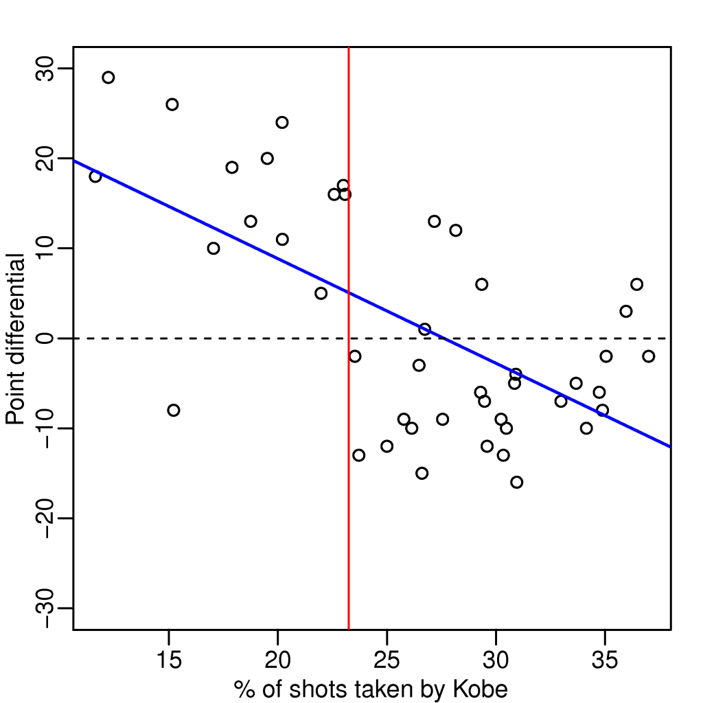

```{r setup, include=FALSE}
knitr::opts_chunk$set(echo = TRUE)
```

# Intro  
This course covers regression analysis, least squares and inference using regression models. Special cases of the regression model, ANOVA and ANCOVA will be covered as well. Analysis of residuals and variability will be investigated. The course will cover modern thinking on model selection and novel uses of regression models including scatterplot smoothing.  

## GitHub Link for Lectures  
**[Link to the GitHub for this course](https://github.com/bcaffo/courses/tree/master/07_RegressionModels)**  

## Course Book 
**[Regression Models for Data Science in R, through Leanpub](https://leanpub.com/regmods)**  

Further Reading: **[Advanced Linear Models for Data Science](https://leanpub.com/lm)**  

## Instructor's Note  
"*We believe that the key word in Data Science is 'science'. Our course track is focused on providing you with three things:*  
1) *An introduction to the key ideas behind working with data in a scientific way that will produce new and reproducible insight*  
2) *An introduction to the tools that will allow you to execute on a data analytic strategy, from raw data in a database to a completed report with interactive graphics*  
3) *Giving you plenty of hands on practice so you can learn the techniques for yourself.*  
  
*Regression Models represents a both fundamental and foundational component of the series, and it presents the single most practical data analysis toolset. Using only a bare minimum of mathematics, we will attempt to provide you with the fundamentals for the application and practice of regression.*  
*We are excited about the opportunity to attempt to scale Data Science education. We intend for the courses to be self-contained, fast-paced, and interactive, and we intend to run them frequently to give people with busy schedules the opportunity to work on material at their own pace.*  
  
*Brian Caffo and the Data Science Track Team*"  

## Data Science Specialization Community Site  
**[The site is created using GitHub Pages](http://datasciencespecialization.github.io/)**  
  
In addition, Johns Hopkins has **[a site on Statistical Methods and Applications for Research in Technology](http://www.smart-stats.org/)** that Dr. Caffo helps manage.  

**Reminder to commit (01) delete this line** ***AFTER*** **committing**  

# Least Squares and Linear Regression  
## Regression  
### Introduction to Regression  
* The simplicity and intrepretability offered by regression models should make them a first tool of choice for any practical problem.  
* First discovered by **[Francis Galton](https://en.wikipedia.org/wiki/Francis_Galton)** who coined most of the terminology we use today.  

#### Relevant Simply Statistics Post  
**[Simply Statistics is a blog by Jeff Leek, Roger Peng and Rafael Irizarry, who wrote this post](https://simplystatistics.org/2013/01/28/data-supports-claim-that-if-kobe-stops-ball-hogging-the-lakers-will-win-more/)**  
  
  
* "Data supports claim that if Kobe stops ball hogging the Lakers will win more"  
* "Linear regression suggests that an increase of 1% in percent of shots taken by Kobe results in a drop of 1.16 (+/- 0.22) in score differential."  
        + Standard error given as "+/- 0.22"  

#### Questions for this Class  
In reference to Galton's parent/children height data, which can be accessed from the `galton` dataset in the `UsingR` package.  
Consider trying to answer the following kinds of questions:  
* To use the parents' heights to predict childrens' heights.  
* To try to find a parsimonious (explain the data), easily described mean relationship between parent and children's heights.  
* To investigate the variation in childrens' heights that appears unrelated to parents' heights (residual variation).  
* To quantify what impact genotype information has beyond parental height in explaining child height.  
* To figure out how/whether and what assumptions are needed to generalize findings beyond the data in question.  
* Why do children of very tall parents tend to be tall, but a little shorter than their parents and why children of very short parents tend to be short, but a little taller than their parents? (This is a famous question called "Regression to the mean".)  

### Introduction to Basic Least Squares  
* Let's look at the data first used by Francis Galton in 1885.  
* Galton was a statistician who invented the term and concepts of regression and correlation, founded the journal Biometrika, and was the cousin of Charles Darwin.  
* Let's look at the marginal (parents disregarding children and children disregarding parents) distributions first.  
        + Parent distribution is all heterosecual couples.  
        + Correction for gender via multiplying female heights by 1.08.  
        + Overplotting is an issue from discretization.  
```{r message=FALSE}
library(UsingR); data(galton); library(reshape2); library(tidyverse)
```
```{r}
long <- melt(galton)
plot <- ggplot(long, aes(x = value, fill = variable)) +
        geom_histogram(colour = "#000000", binwidth = 1)
plot + facet_grid(.~variable)
```
  
#### Finding the Middle via Least Squares  
* Consider only the children's heights  
        + How could one describe the "middle"?  
        + One definition, let $Y_i$ be the height of child $i$ for $i = 1,...,n=928$, then define the middle as the value of $\mu$ that minimizes  
$\sum_{i=1}^n (Y_i - \mu)^2$  
* This is the physical center of mass of the histogram.  
* The result of this is that $\mu = \bar{Y}$  
```{r}
ggplot(galton, aes(x = child)) +
        geom_histogram(fill = "salmon", colour = "#000000", binwidth = 1) +
        geom_vline(xintercept = mean(galton$child), size = 3)
```
  
* The above plot of child heights has a mean of `r mean(galton$child)`


### Technical Details  
Proof that $\bar{Y}$ is the minimizer for $\sum_{i=1}^n (Y_i - \mu)^2$  
$\sum_{i=1}^n (Y_i - \mu)^2 = \sum_{i=1}^n (Y_i - \bar{Y} + \bar{Y} - \mu)^2\\ =\sum_{i=1}^n(Y_i-\bar{Y}^2 + 2\sum_{i=1}^n(Y_i-\bar{Y})(\bar{Y}-\mu) +\sum_{i=1}^n(\bar{Y} -\mu)^2\\ =\sum_{i=1}^n(Y_i-\bar{Y})^2+2(\bar{Y}-\mu)\sum_{i=1}^n(Y_i-\bar{Y})+\sum_{i=1}^n(\bar{Y}-\mu)^2\\ =\sum_{i=1}^n(Y_i-\bar{Y})^2+2(\bar{Y}-\mu)(\sum_{i=1}^nY_i-n\bar{Y})+\sum_{i=1}^n(\bar{Y}-\mu)^2\\ =\sum_{i=1}^n(Y_i-\bar{Y})^2+0+\sum_{i=1}^n(\bar{Y}-\mu)^2\\ \geq \sum_{i=1}^n(Y_i-\bar{Y})^2$  
  
Therefore, $\sum_{i=1}^n (Y_i - \mu)^2$ is minimized when $\bar{Y}=\mu$  

### Introductory Data Example  
#### Comparing Childrens' Heights and Their Parents' Heights  
```{r}
ggplot(galton, aes(x = parent, y = child)) + geom_point()
```
  
* These points are overplotted, there are multiple overlays at each point, so let's make a better plot  
```{r}
freqData <- as.data.frame(table(galton$child, galton$parent))
names(freqData) <- c("child", "parent", "freq")
freqData$child <- as.numeric(as.character(freqData$child))
freqData$parent <- as.numeric(as.character(freqData$parent))
plot <- ggplot(filter(freqData, freq > 0), aes(x = parent, y = child)) +
        scale_size(range = c(2, 20), guide = "none") +
        geom_point(colour = "grey50", 
                   aes(size = freq + 20, show_guide = FALSE)) +
        geom_point(aes(colour = freq, size = freq)) +
        scale_colour_gradient(low = "lightblue", high = "#FFFFFF")
plot
```
  
#### Regression Through the Origin  
* Suppose that $X_i$ are the parents' heights  
* Consider picking the slope $\beta$ that minimizes  
$\sum_{i=1}^n(Y_i-X_i\beta)^2$  
* This is exactly using the orgin as a pivot point picking the line that minimizes the sum of squared vertical distances of the points to the line  
* Subtract the means so that the orgin is the mean of the parent and children's heights  
        + A plot with a regression line going through true (0,0) often doesn't make sense, so subtracting the means realigns the orgin to be in the middle of the data  
```{r}
freqData <- as.data.frame(table(galton$parent - mean(galton$parent),
                                galton$child - mean(galton$child)))
names(freqData) <- c("child", "parent", "freq") 
freqData$child <- as.numeric(as.character(freqData$child))
freqData$parent <- as.numeric(as.character(freqData$parent))
plot <- ggplot(filter(freqData, freq > 0), aes(x = parent, y = child)) +
        scale_size(range = c(2, 20), guide = "none") +
        geom_point(colour = "grey50", 
                   aes(size = freq + 20)) + 
        geom_point(aes(colour = freq, size = freq)) +
        scale_colour_gradient(low = "lightblue", high = "#FFFFFF") +
        geom_abline(intercept = 0, 
                    
                slope = lm(
                        I(child - mean(child)) ~ 
                                I(parent - mean(parent)) - 1, 
                        data = galton)$coeff,
                
                    size = 3)
plot
```
  
* In the next few lectures we'll talk about why this is the solution  
```{r}
lm(I(child - mean(child)) ~ I(parent - mean(parent)) - 1, data = galton)
```
  
* The `I` function just ignores the intercept, since we already adjusted for that  
* We can also fit a line to an un-adjusted model  
```{r}
freqData <- as.data.frame(table(galton$child, galton$parent))
names(freqData) <- c("child", "parent", "freq")
freqData$child <- as.numeric(as.character(freqData$child))
freqData$parent <- as.numeric(as.character(freqData$parent))
plot <- ggplot(filter(freqData, freq > 0), aes(x = parent, y = child)) +
        scale_size(range = c(2, 20), guide = "none" ) +
        geom_point(colour = "grey50", aes(size = freq + 20)) +
        geom_point(aes(colour = freq, size = freq)) +
        scale_colour_gradient(low = "lightblue", high = "#FFFFFF")                    
lm1 <- lm(galton$child ~ galton$parent)
plot + geom_abline(intercept = coef(lm1)[1], slope = coef(lm1)[2], 
                   size = 3, colour = "#888888")
```
  
  
### Lesson with `swirl()`: Introduction  
* Another way we could have gotten past overlapping plot points is to use the `jitter` function  
```{r}
plot(jitter(child,4) ~ parent, galton)
```


## Linear Least Squares  
* Also called **Ordinary Least Squares (OLS)**; it fits a line through some data.  

### Notation and Background  
#### Notation  
* The empirical mean is defined as  
$\bar{X} = \frac{1}{n}\sum_{i=1}^{n}X_i$  
* If we subtract the mean from data points, we get data that has a mean of 0. That is, if we define:  
$\tilde{X}_i=X_i-\bar{X}$.  
        + The mean of $\tilde{X}_i$ is 0  
* This process is called "**centering**" the random variables  
* Recall from the previous lecture that the mean is the elast squares solution for minimizing $\sum_{i=1}^n(X_i-\mu)^2$  
  
#### The Emprical Standard Deviation adn Variance  
* Define the empirical variance as  
$S^2 = \frac{1}{n-1} \sum_{i=1}^n(X_i-\bar{X})^2 = \frac{1}{n-1}(\sum_{i=1}^n X_i^2 - n\bar{X}^2)$  
* The empirical standard deviation is defined as $S = \sqrt{S^2}$.  
        + Notice that the standard deviation has the same units as the data.  
* The data defined by $\frac{X_i}{s}$ have an empirical standard deviation of 1. 
        + This is called "**scaling**" the data.  

#### Normalization  
* The data defined by  
$Z_i = \frac{X_i-\bar{X}}{s}$  
have an empirical mean of 0 and an empirical standard deviation of 1.  
* The process of centering then scaling the data is called "**normalizing**" the data.  
* Normalized data are centered at 0 and have units equal to standard deviations of the original data.  
* For example, a value of 2 from normalized data is saying that data point was two standard deviations larger than the mean.  

#### The Empirical Covariance  
* Consider now when we have pairs of data, $(X_i, Y_i)$  
* Their empirical covariance is  
$Cov(X,Y) = \frac{1}{n-1}\sum_{i=1}{n}(X_i-\bar{X})(Y_i-\bar{Y})\\ =\frac{1}{n-1}(\sum_{i=1}^nX_i Y_i - n\bar{X}\bar{Y})$  
* The correlation is defined as  
$Cor(X,Y) = \frac{Cov(X,Y)}{S_x S_y}$  
        + Where $S_x$ and $S_y$ are the estimates of standard deviaitons for the X observations and Y observations, respectively.  
        
#### Some Facts About Correlation  
* $Cor(X,Y) = Cor(Y, X)$  
* $-1 \leq Cor(X,Y) \leq 1$  
* $Cor(X,Y) = 1$ and $Cor(X,Y) = -1$ only when the $X$ or $Y$ observations fall perfectly on a positive or negative sloped line, repectively.  
* $Cor(X,Y)$ measures the strength of the linear relationship between the $X$ and $Y$ data, with stronger relationships as $Cor(X,Y)$ heads towards either -1 or 1  {
* $Cor(X,Y)=0$ implies no linear relationship  


### Linear Least Squares  
#### Fitting the Best Line  
* Let $Y_i$ be the $i^{th}$ child's height and $X_i$ be the $i^{th}$ (average over the pair of) parents' heights.  
* Consider finding the best line   
        + Child's Height = $\beta_0$ + Parent's Height * $\beta_1$  
$\sum_{i=1}^{n} {Y_i - (\beta_0 + \beta_1 X_i)}^2$  
  
  
* the least squares model fit to the line $Y = \beta_0 + \beta_1 X$ through the data pairs $(X_i, Y_i)$ with $Y_i$ as the outcome obtains the line $Y=\hat{\beta_0} + \hat{\beta_1} X$ where  
$\hat{\beta_1} = Cor(Y,X)\frac{Sd(Y)}{Sd(X)}$  
$\hat{\beta_0}=\bar{Y}-\hat{\beta_1}\bar{X}$  
* $\hat{\beta_1}$ has the units of $Y/X$, $\hat{\beta_0}$ has the units of $Y$.  
* The line passes through the point $(\bar{X},\bar{Y})$  
* The slope of the regression line with $X$ as the outcome and $Y$ as the predictor is $\frac{Cor(Y,X)Sd(X)}{Sd(Y)}$  
* The slope si the same one you would get if you centered the data, $(X_i - \bar{X}, Y_i-\bar{Y})$, and made a regression through the orgin  
* If you normalized the data, $(\frac{X_i-\bar{X}}{Sd(X)}, \frac{Y_i-\bar{Y}}{Sd(Y)})$, the slope is $Cor(Y, X)$  

### Linear Least Squares Coding Example  
```{r}
y <- galton$child
x <- galton$parent
beta1 <- cor(y,x) * sd(y) / sd(x)
beta0 <- mean(y) - beta1 * mean(x)

#Showing the computations by hand are the same as coef from lm function
rbind(c(beta0, beta1), coef(lm(y~x)))
```
  
* `lm` stands for *linear model*  
```{r}
#The slope is the same in centered data  
yc <- y - mean(y)
xc <- x - mean(x)
beta1 <- sum(yc * xc) / sum(xc^2)
c(beta1, coef(lm(y ~ x))[2])
lm(yc ~ xc - 1)$coef #minus 1 gets rid of intercept
```

```{r}
#Normalizing variables results in the slope being the correlation
yn <- (y - mean(y))/sd(y)
xn <- (x - mean(x))/sd(x)
results <- cbind(cor(y,x), lm(yn ~ xn)$coef[2], cor(yn, xn))
colnames(results) <- c("cor(y,x)", "Slope(yn ~ xn)", "cor(yn, xn)")
results
```

#### Adding a Linear Regression to ggplot  
```{r}
plot <- ggplot(filter(freqData, freq > 0), aes(parent, child)) +
        scale_size(range = c(2, 20), guide = "none") +
        geom_point(colour = "grey50", aes(size = freq + 20)) +
        geom_point(aes(colour = freq, size = freq)) +
        scale_colour_gradient(low = "#5BC2E7", high = "#FFFFFF")

#Adding smoother
#y ~ x is assumed if not given
plot + geom_smooth(method = "lm", formula = y ~ x) 
```
  
* A confidence interval is also given around the line automaticly  

### Technical Details  
**[Brian Caffo discusses the proof for least squares regression beta_1 value in this video](https://youtu.be/COVQX8WZVA8)**  


### Lesson with `swirl()`: Least Squares Estimation  
(No new content)

**Reminder to commit (03) delete this line** ***AFTER*** **committing**  

## Regression to the Mean  
### Regression to the Mean  
* $P(Y < x|X = x)$ gets bigger as $x$ tends towards very large values.  
        + Similarly $P(Y>x|X=x)$ gets bigger as $x$ tends towards very small values.  
* Regression line is like the intrisic part of this relation  
        + Unless $Cor(Y,X) = 1$ the intrinsic part isn't perfect  
* Suppose we center $X$ (child's hieght) and $Y$ (parent's height) so that they both have a mean of 0  
        + Then, recall, our regression line passes through $(0,0)$  
* We then normalize the data points too  
        + The slope of the regression line is $Cor(Y,X)$, regardless of which variable is the outcome (since both $sd$s are 1)  
* If the outcome is plotted on the horizontal axis the slope of the least squares line will be $\frac{1}{Cor(Y,X)}$  

#### Plotting the Regression Implicitly  
```{r}
library(UsingR); data(father.son)
y <- father.son$sheight
x <- father.son$fheight
y <- (y - mean(y)) / sd(y)
x <- (x - mean(x)) / sd(x)
rho <- cor(x, y) #rho is std greek letter for correlations  
plot <- ggplot(data.frame(Father = x, Son = y), aes(Father, Son)) +
        geom_point(size = 6, colour = "#000000", alpha = 0.2) +
        geom_point(size = 4, colour = "salmon", alpha = 0.2) +
        xlim(-4,4) + 
        ylim(-4,4) + #Std. norm being +/- 4 is very unlikely
        geom_abline(intercept = 0, slope = 1, alpha = 0.5) +
        geom_vline(xintercept = 0, alpha = 0.5) +
        geom_hline(yintercept = 0, alpha = 0.5)
plot + geom_abline(intercept = 0, slope = rho, size = 2, colour = "#5BC2E7")
plot + geom_abline(intercept = 0, slope = 1/rho, size = 2, colour = "#7E2CB5")
```
* The blue line is where the Father's height is the predictor and the Son's height is the outcome  
* The purple line is where the Son's hieght is the predictor and the Father's height is the outcome (`1/rho` because the outcome is on the horizontal axis)

### Lesson with `swirl()`: Residuals  
* A residual is the distance between the actual data point and the regression line.  
        + I've previously heard it also called the "Unexplained Variation" since the distance form the mean value to data point is the "Total Variation (from the mean)", then the distance from the mean to reg. line is the "Explained Variation".  
* You can get some info on a data sets residuals by calling `summary` on the results of `lm` as seen below  
```{r}
summary(lm(child ~ parent, galton))
```
* `est` will return the estimate, $\hat{y}$  
* `sqe` will calculate the sum of the squared residuals, also called the Residual Sum of Squares  
* var(residuals) = var(data) - var(estimate)  
        + As such the variance of residuals is always less than the variance of data  
* The residuals shouldn't be correlated to either factor, if it did this may imply a diffrent relationship is present  


## Quiz 1  

1. Given...

```{r}
x <- c(0.18, -1.54, 0.42, 0.95)
w <- c(2, 1, 3, 1)
```
   Give the value of $\mu$ that minimizes the least squares equation $\sum_{i=1}{n}w_i(x_i-\mu)^2$  
```{r}
sum(w * x) / sum(w)
```
   
  
2. Given...  

```{r}
x <- c(0.8, 0.47, 0.51, 0.73, 0.36, 0.58, 0.57, 0.85, 0.44, 0.42)
y <- c(1.39, 0.72, 1.55, 0.48, 1.19, -1.59, 1.23, -0.65, 1.49, 0.05)
```
   Fit the regression through the orgin and get the slope treating y as the outsome and x as the regressor.  

```{r}
lm(y ~ x - 1)$coef
```
  
3. Do `data(mtcars)` from the datasets package and fit the regression model with mpg as the outcome and weight as the predictor. Give the slope coefficient.  

```{r}
data(mtcars)
lm(mpg ~ wt, mtcars)$coef
```
  
4. Consider data with an outcome (Y) and a predictor (X). The standard deviation of the predictor is one half that of the outcome. The correlation between the two variables is 0.5. What value would the slope coefficient for the regression model with Y as the outcome and X as the predictor?  

```{r}
0.5 * 2/1
```
  
5. Students were given two hard tests and scores were normalized to have empirical mean 0 and variance 1. The correlation between the scores on the two tests was 0.4. What would be the expected score on Quiz 2 for a student who had a normalized score of 1.5 on Quiz 1?  

```{r}
beta1 <- 0.4 * 1/1
beta0 <- 0 - beta1*0
yhat <- beta0 + beta1*1.5
yhat
```
  
6. Given...  
```{r}
x <- c(8.58, 10.46, 9.01, 9.64, 8.86)
```
What is the value of the first measurement if x were normalized?

```{r}
xn <- (x-mean(x))/sd(x)
xn[1]
```
  
7. Given...  

```{r}
x <- c(0.8, 0.47, 0.51, 0.73, 0.36, 0.58, 0.57, 0.85, 0.44, 0.42)
y <- c(1.39, 0.72, 1.55, 0.48, 1.19, -1.59, 1.23, -0.65, 1.49, 0.05)
```
   What is the intercept for fitting the model with x as the predictor and y as the outcome?  

```{r}
lm(y ~ x)$coef
```
  
8. You know that both the predictor and response have mean 0. What can be said about the intercept when you fit a linear regression?

* The intercept is the orgin
  
9. Given...  

```{r}
x <- c(0.8, 0.47, 0.51, 0.73, 0.36, 0.58, 0.57, 0.85, 0.44, 0.42)
```
   What value minimizes the sum of the squared distances between these points and itself?  
```{r}
mean(x)
```
   
  
  
10. Let the slope having fit Y as the outcome and X as the predictor be denoted as $\beta_1$. Let the slope from fitting X as the outcome and Y as the predictor be denoted as $\gamma_1$. Suppose that you divide $\beta_1$ by $\gamma_1$ What is this ratio always equal to?  

* $\beta_1 = Cor(Y,X)\frac{sd(Y)}{sd(X)}$  
* $\gamma_1 = Cor(Y,X)\frac{sd(X)}{sd(Y)}$  
* $\frac{\beta_1}{\gamma_1} = \frac{Cor(Y,X)*sd(Y)/sd(X)}{Cor(Y,X)*sd(X)/sd(Y)} = \frac{sd(Y)*sd(Y)}{sd(X)*sd(X)} = \frac{Var(Y)}{Var(X)}$  
  
# Linear Regression & Multivariable Regression  
## Statistical Linear Regression Models  
### Statistical Linear Regression Models  
#### Basic Regression Model with Additive Gaussian Errors  
* Consider developing a probabilistic model for linear regression  
$Y_i = \beta_0 + \beta_1 X_i + \epsilon_i$  
        + Here the $\epsilon_i$ are assumed iid $N(0, \sigma^2)$  
                - Can be thought of as accumulated variables that aren't modeled by act on the response as iid gaussian errors
        + $E[Y_i | X_i = x_i] = \mu_i = \beta_0 + \beta_1 x_i$  
        + $Var(Y_i | X_i = x_i) = \sigma^2$  


### Interpreting Coefficients  
#### Intercept  
* $\beta_0$ is the expected value of the response when the predictor is 0  
$E[Y|X = 0] = \beta_0 + \beta_1 \times 0 = \beta_0$  
        + This isn't always a value of interest, for example when $X = 0$ is impossible (x represents weight) or far outside of the range of data.  
* A solution to non-interpretable intercepts is to shift the equation by some value, $a$ then define a new intercept, $\tilde{\beta_0}$.  
$Y_i = \beta_0 + \beta_1X_i+\epsilon_i=\beta_0 + a\beta_1+\beta_1(X_i-a)+\epsilon_i = \tilde{\beta_0}+\beta_1(X_i-a)+\epsilon_i$  
        + Shifting your $X$ values by value $a$ changes the intercept, but not the slope.  
        + Often $a$ is set to $\bar{X}$ so that the intercept is inteerpretted as the expected response at the average X value.  

#### Slope  
* $\beta_1$ is the expected change in response for a 1 unit change in the predictor  
* Consider the impact of changing the units of $X$.  
$Y_i = \beta_0 + \beta_1X_i + \epsilon_i = \beta_o + \frac{\beta_1}{a}(X_ia) + \epsilon_i = \beta_0 + \tilde{\beta_1}(X_ia) + \epsilon_i$  
        + Since $\beta_1$ is in units of Y/X we divide by the factor, $a$, that we're multiplying with $X_i$.  
* Example: $X$ is height in *m* and $Y$ is weight in *kg*. Then $\beta_1$ is *kg/m*. Converting $X$ to *cm* implies multiplying $X$ by 100*cm/m*. To get $\beta_1$ in the right units, we have to divide by 100*cm/m* to get it to have the right units.  
$Xm \times \frac{100cm}{m} = (100X)cm$ and $\beta_1 \frac{kg}{m} \times \frac{1m}{100cm} = (\frac{\beta_1}{100})\frac{kg}{cm}$

### Linear Regression for Prediction  
* We can get a prediction for Y, $\hat{y}$ by plugging in the X that we want into our model  
$\hat{y}_i = \hat{\beta_0} + \hat{\beta_1}X_i$  

#### Example using diamond Data  
* The data in this example is diamond prices (in Sigapore dollars) and diamond weight in carats (1 carat = 0.2 g).  
```{r}
library(UsingR); data(diamond); library(tidyverse)
plot <- ggplot(diamond, aes(carat, price)) +
        xlab("Mass (carats)") +
        ylab("Price (SIN $)") +
        geom_point(size = 6, colour = "#000000", alpha = 0.2) +
        geom_point(size = 5, colour = "#5BC2E7", alpha = 0.2)
plot + geom_smooth(method = "lm", colour = "#000000", formula = y ~ x)
```
#### Creating a Model  
```{r}
# Fitting the linear regression model
fit <- lm(price ~ carat, data = diamond)
coef(fit)
```

* We estimate an expected 3721.02 (SIN) dollar increase in price for every increase of 1 carat in mass of diamonds.
* The intercept, -259.63 is the expected price of a 0 carat diamond, which doesn't make sense to interpret.  
        + As such we'll mean center our reg. line  
#### Centering Model on the Mean
```{r}
cfit <- lm(price ~ I(carat - mean(carat)), data = diamond)
cfit$coef
```
* To do arithmetic operations in the formula in `lm` you have to surround the operation with the `I` function  
* The slope has not changed  
* The intercept has changed to $500$, the expected price for the average sized diamond of the data (`r round(mean(diamond$carat), 3)` carats).  
  
#### Changing Units in the Model  
* Change unit to 1/10 of a carrat  
```{r}
tenthfit <- lm(price ~ I(carat * 10), data = diamond)
coef(tenthfit)
```
* So now the slope is interpretted as a `r round(tenthfit$coef[2], 2)` dollar increase for every additional 0.1 carrats of diamond.  

#### Estimating a Value  
```{r}
newDiamonds <- c(0.16, 0.27, 0.34)
#Computing manually
fit$coef[1] + fit$coef[2] * newDiamonds

#Using predict function
results <- predict(fit, newdata = data.frame(carat = newDiamonds))
names(results) <- as.character(newDiamonds) #renaming not required
results
```

```{r}
#Using predict without `newdata` will return y-hat for given x values
predict(fit)
plot + geom_smooth(method = "lm", colour = "#000000", formula = y ~ x) +
        geom_point(aes(y = as.numeric(predict(fit))),
                   size = 3, color = "#FF0000", shape = 17)
```


**Reminder to commit (05) delete this line** ***AFTER*** **committing**  

## Residuals  
### Residuals  
* The residuals are the variation from the regression line, that is left unexplained by our model, $Y_i = \beta_0 + \beta_1X_i + \epsilon_i$ where $\epsilon_i \sim N(0,\sigma^2)$.  
* Observed outcome $i$ is $Y_i$ at predictor value $X_i$  
* Predicted outcome $i$ is $\hat{Y}_i$ at predictor value $X_i$ is $\hat{Y}_i = \hat{\beta}_0 + \hat{\beta}_1 X_i$  
* Residual, $e_i$,  is the difference between the observed and predicted outcome: $e_i = Y_i - \hat{Y}_i$.  
        + This is the vertical distanc ebetween the observed data point and the regression line  
* Least squares minimizes these residuals, the equation $\sum_{i=1}^n e_i^2$  
* The $e_i$ can be thought of as estimates of the $\epsilon_i$  

#### Properties of the Residuals  
* $E[e_i] = 0$  
* If an intercept is included, $\sum_{i=1}^n e_i = 0$  
* If a regressor variable, $X_i$, is included in the model $\sum_{i=1}^n e_iX_i = 0$  
* Residuals are useful for investigating poor model fit  
        + Residual plots can highlight these poor fits  
* Residuals can be though of as the outcome ($Y$) with the linear association of the predictor ($X$) removed.  
* One differentiates residual variation (variation after removing the predictor) from systematic variation (variation explained by the regression model).  


### Residuals, Coding Example  
* Using diamond dataset again  
```{r}
data("diamond")
y <- diamond$price 
x <- diamond$carat
fit <- lm(y ~ x)

e <- resid(fit) #Getting residuals

yhat <- predict(fit)

# Showing residuals are the same as y - yhat (within a floating point error)
max(abs(e - (y - yhat)))

# And again, but manually entering the equation for yhat
max(abs(e - (y - (coef(fit)[1] + coef(fit)[2] * x))))

#Showing sum of resid and resid*x are both 0
sum(e)
sum(e * x)
```

```{r}
#Plotting the residuals 
plot <- ggplot(data.frame(x = x, y = y, resid = e), aes(x, resid)) +
        
        geom_segment(aes(xend = x, yend = 0), colour = "#FF0000") +
        
        geom_point(size = 2, colour = "#5BC2E7", alpha = 0.5) +
        xlab("Mass (carats)") +
        ylab("Residuals (SIN $)") +
        geom_hline(yintercept = 0, color = "#000000")
plot
```

#### Using Residual Plot to Detect a Poorly Fit Model  
* We're going to generate some data that looks linear but actually has an underlying relation to it that will become more apparent after plotting the residuals  
```{r}
set.seed(1618033)
x <- runif(100, -3, 3)
y <- x + sin(x) + #Y is related with sin(x), lm will expose the sin(x) rel.
        rnorm(100, sd = .2) # For noise
plot <- ggplot(data.frame(x = x, y = y), aes(x,y)) +
        geom_smooth(method = "lm", colour = "#000000") +
        geom_point(size = 7, colour = "#000000", alpha = 0.4) +
        geom_point(size = 5, colour = "#FF0000", alpha = 0.4)

residplot <- ggplot(data.frame(x = x, resid = resid(lm(y ~ x))), 
                    aes(x, resid)) +
        geom_hline(yintercept = 0) +
        geom_point(size = 7, colour = "#000000", alpha = 0.4) +
        geom_point(size = 5, colour = "#FF0000", alpha = 0.4) +
        labs(x = "X", y = "Residual")
plot
residplot
```

* A secondary pattern can be seen in the residual plot, indicating there might be a better model than a line.  

#### Detecting Heteroskedasticity with a Residual Plot  
```{r}
x <- runif(100, 0, 6)
y <- x + rnorm(100, mean = 0, sd = 0.001 * x)#sd increases as x increases
plot <- ggplot(data.frame(x = x, y = y), aes(x,y)) +
        geom_smooth(method = "lm", colour = "black") +
        geom_point(size = 7, colour = "#000000", alpha = 0.4) +
        geom_point(size = 5, colour = "#FF0000", alpha = 0.4)
residplot <- ggplot(data.frame(x = x, resid = resid(lm(y ~ x))), 
                    aes(x,resid)) +
        geom_hline(yintercept = 0, colour = "#000000") +
        geom_point(size = 7, colour = "#000000", alpha = 0.4) +
        geom_point(size = 5, colour = "#FF0000", alpha = 0.4)
plot
residplot
```
* The plot looks linear, but plotting the residuals reveals an underlying pattern


### Residual Variance  
#### Estimating Residual Variaiton  
* Model: $Y_i = \beta_0 + \beta_1 X_i + \epsilon_i$ where $\epsilon_i \sim N(0, \sigma^2)$  
* The mean linear estimate of $\sigma^2$ is $\frac{1}{n}\sum_{i=1}^ne_i^2$, the average squared residual  
* Most people use:  
$\hat{\sigma}^2 = \frac{1}{n-2}\sum_{i=1}^ne_i^2$  
        + with $n-2$ instead of $n$ so that $E[\hat{\sigma}^2]=\sigma^2$  

#### Diamond Example  
```{r}
y <- diamond$price
x <- diamond$carat
n <- length(y)

#Solving resid s.d. implicitly
sqrt(sum(resid(fit)^2) / (n - 2))

#Getting resid deviation with functions
fit <- lm(y ~ x)
summary(fit)$sigma

#You can see the value in the summary print out here:
summary(fit)
```

#### Summarizing Variation  
* **Total Variability** - the variability around an intercept (mean only regression)
        + $\sum_{i=1}^n(Y_i - \bar{Y})^2$  
        + Sum of Regression & Error Variability  
* **Regression Variability** - the variability that is explained by adding the predictor  
        + $\sum_{i=1}^n(\hat{Y}_i - \bar{Y})^2$  
* **Error Variability** - what's leftover around the regression line  
        + $\sum_{i=1}^n(Y_i - \hat{Y})^2$  

#### R Squared, the Coefficent of Determination  
* R squared is the percentage of the total variability that is explained by the linear relationship with the predictor  
$R^2 = \frac{\sum_{i=1}^n(\hat{Y}_i - \bar{Y})^2}{\sum_{i=1}^n(Y_i - \bar{Y})^2}$  
* $R^2$ is the percentage of variation explained by the regression model  
* $0 \leq R^2 \leq 1$  
* $R^2$ is the sample correlation squared  
* $R^2$ can bea  misleading summary of model fit  
        + Deleting data can inflate $R^2$  
        + (For later,) Adding terms to a regression model always increases $R^2$  
* Execute `example(anscombe)` to see the following data:  
        + Basically same mean and variance of X and Y  
        + Identical correlations (hence the same $R^2$ value)  
        + Same linear regression relationship  


### Lesson with `swirl()`: Residual Variation  
* `deviance` will calculate the sum of the squares of a `lm`  

## Inference in Regression  
### Inference in Regression  
#### Recall Our Model and Fitted Values  
* Model:  
        + $Y_i = \beta_0 + \beta_1X_i+\epsilon_i$  
        + $\epsilon \sim N(0,\sigma^2)$, an error term  
        + $\hat{\beta}_1 = Cor(Y, X) \frac{Sd(Y)}{Sd(X)}$  
        + $\hat{\beta}_0 = \bar{Y} - \hat{\beta}_1\bar{X}$  
        
* We assume that the true model is known for most of this course  

#### Review Some Statistical Inference Concepts  
* Statistics like $\frac{\hat{\theta} - \theta}{\hat{\sigma}_{\hat{\theta}}}$ often have the following properties:  
        + Is normally distributed and ahs a finite sample Student's T distribution if the estimated variance is repalced with a sample estimate (under normality assumptions).  
        + Can be used to test $H_0 : \theta = \theta_0$ versus $H_a : \theta >,<,\neq \theta_0$  
        + Can be used to create a confidence interval for $\theta$ via $\hat{\theta} \pm Q_{1-\alpha/2}\hat{\sigma}_{\hat{\theta}}$ where $Q_{1-\alpha/2}$ is the relevant quantile from either a normal or T distribution  
* In the case of regression with iid sampling assumptions and normal errors, out inferences will follow very similarily to what was discussed in the inference class.  
* Under assumptions on the ways in which the $X$ values are collected the iid sampling model, and mean model, the nromal results hold to create intervals and confidence intervals  

#### Explanation  
* Variance of our regression slope, $\sigma_{\hat{\beta_1}}^2$, tells both how variable points are around the regression line, $\sigma^2$, and how variable the points are from the mean  
$\sigma_{\hat{\beta_1}}^2 = Var(\hat{\beta_1}) = \sigma^2/\sum_{i=1}^n(X_i-\bar{X})^2$  
        + This implies spreaded out points will give a lower variance for a slope  
                - Thus large cluster of points very far apart would give the best variance, although this lm would assume the uncollected data between the clusters is linear  

* Variance of the intercept, $\sigma_{\hat{\beta_0}}^2$, is less informative but still can provide some information.  
$\sigma_{\hat{\beta_0}}^2 = Var(\hat{\beta}_0 = (\frac{1}{n} + \frac{\bar{X}^2}{\sum_{i=1}^n(X_i - \bar{X})^2})\sigma^2$  
* In both these cases, in practice, $\sigma$ is replaced by its estimate  
* Under iid gaussian errors, $\frac{\hat{\beta_j} - \beta_j}{\hat{\sigma_{\hat{\beta}_j}}}$, follows a $t$ distribution with $n - 2$ degrees of freedom and a normal distribution for large $n$  
        + This can be used to create confidence intervals and perform hypothesis tests.  

### Coding Example  
* Showing R is calculating all these values as we have given  
```{r}
library(UsingR); data(diamond)
y <- diamond$price
x <- diamond$carat
n <- length(y)
beta1 <- cor(y, x) * sd(y) / sd(x) #Slope  
beta0 <- mean(y) - beta1 * mean(x) #y-intercept
e <- y - (beta0 + beta1 * x) #resids
sigma <- sqrt(sum(e^2) / (n-2)) #est. sd for resids
ssx <- sum((x - mean(x))^2) #Numerator of variance calculation
seBeta0 <- sqrt((1 / n + mean(x)^2 / ssx)) * sigma #s.e. of intercept
seBeta1 <- sigma / sqrt(ssx) #s.e. of slope 
tBeta0 <- beta0 / seBeta0 #t statistic for intercept; H_0: beta0=0
tBeta1 <- beta1 / seBeta1 # t statistic for slope
#Relevant p values
pBeta0 <-  2 * pt(abs(tBeta0), df = n - 2, lower.tail = FALSE)
pBeta1 <-  2 * pt(abs(tBeta1), df = n - 2, lower.tail = FALSE)
coefTable <- rbind(c(beta0, seBeta0, tBeta0, pBeta0), c(beta1, seBeta1, tBeta1, pBeta1))
colnames(coefTable) <- c("Estimate", "Std. Error", "t value", "P(>|t|)")
rownames(coefTable) <- c("(Intercept)", "x")
coefTable
summary(lm(y ~ x))$coef
```
#### Generating Confidence Intervals
```{r}
fit <- lm(y ~ x)
sumCoef <- summary(fit)$coef

#Intercept
sumCoef[1, 1] + c(-1, 1) * qt(0.975, df = fit$df) * sumCoef[1, 2]

#Slope; Change in x per 1 y unit
sumCoef[2, 1] + c(-1, 1) * qt(0.975, df = fit$df) * sumCoef[2, 2]
```


### Prediction  
* Consider predicting $Y$ at a value of $X$  
        + Predicting the price of a diamond given the carat  
        + Predicting the height of a child given the height of the parents  
* The obvious estimate for prediction at point $x_0$ is $\hat{\beta_0} + \hat{\beta_1}x_0$  
* A standard error is needed to create a prediction interval  
* There's a distinction between intervals for the regression line at points and the prediction of what a $y$ would be at point $x_0$  
* Line at $x_0$ std. error: $\hat{\sigma}\sqrt{\frac{1}{n} + \frac{(x_0 - \bar{x})^2}{\sum_{i=1}^n(X_i-\bar{X})^2}}$  
        + Variance will be the least when predicting the average of x  
        + The denominator is how variable the 'x's are, so the more variability the less this error
* Prediction interval std. error at $x_0$: $\hat{\sigma}\sqrt{1 + \frac{1}{n} + \frac{(x_0 - \bar{x})^2}{\sum_{i=1}^n(X_i-\bar{X})^2}}$  

#### Generating Prediction Intervals in Diamond Data Set  
```{r}
newx <- data.frame(x = seq(min(x), max(x), length = 100))
##Data Wranglin'
p1 <- data.frame(predict(fit, newdata = newx, interval = ("confidence")))
p2 <- data.frame(predict(fit, newdata = newx, interval = ("prediction")))
#p1 is giving confidence for each interval
#p2 is giving the actual prediction at that data value

p1$interval = "confidence"
p2$interval = "prediction"
p1$x <- newx$x
p2$x <- newx$x
dat <- rbind(p1, p2)
names(dat)[1] <- "y"

##Plotting
plot <- ggplot(dat, aes(x, y)) +
        geom_ribbon(aes(ymin = lwr, ymax = upr, fill = interval), 
                    alpha = 0.4) +
        geom_line() +
        geom_point(data = data.frame(x = x, y = y), size = 4)
plot
```
* Blue is prediction area, salmon color is preciting the line at each spot.  
        + Both get narrower near middle since we're more confident as we are closer to the mean of x.  
        

### Lesson with `swirl()`: Introduction to Multivariable Regression 
* Once we identify one regression line we can eliminate it to reduce the dimensions of data  
* By subtracting the mean from each variable, the regression line goes through the orgin, hence its intercept is zero.  
        + thus we eliminate one of the two regressors, the constant, leaving just the predicting variable  
        + Subtracting the means is a special case of Gaussian Elimination  
                - We pick one regressor and replace all other varaibles by the residuals of their regressions against that one  
        + Subtracting the mean is equivalent to replacing a varaible by the residual of its regression against 1.  
                - as such `lm(child ~ 1, galton)` will give an intercept of the mean, with a slope of 0.    
                
#### Eliminate Variable Function  
* First we want a function to regress the given variable on the given predictor, suppressing the intercept, and return the residual.
```{r}
regressOneOnOne <- function(predictor, other, dataframe){
  # Point A. Create a formula such as Girth ~ Height -1
  formula <- paste0(other, " ~ ", predictor, " - 1")
  # Use the formula in a regression and return the residual.
  resid(lm(formula, dataframe))
}
```

* Using that function we can write another function to eliminate the specified predictor from the dataframe by regressing all other variables on that predictor and returning a data frame containing the residuals of those regressions.  
```{r}
eliminate <- function(predictor, dataframe){
  # Find the names of all columns except the predictor.
  others <- setdiff(names(dataframe), predictor)
  # Calculate the residuals of each when regressed against 
  # the given predictor with the previous function
  temp <- sapply(others, function(other)regressOneOnOne(predictor, other, dataframe))
  # convert matrix of resids to a data frame and return.
  as.data.frame(temp)
}
```

* We could use eliminate multiple times to get rid of more and more variables, each time essentially using Gaussian elimination to re-express all the terms such that they are plotted with the mean's intercection as the orgin. This in turn replaces the outcome and all other regressors by their residuals against the chosen variable.  


### Lesson with `swirl()`: MultiVar Examples  
* This data was gathered in 1888 in Switzerland, below are explaination fo the variables, all of which except fertility represent proportions of the population.  
        + Fertility - a common standardized fertility measure  
        + Agriculture - % of males involved in agriculture as occupation  
        + Examination - % draftees receiving highest mark on army examination  
        + Education - % education beyond primary school for draftees  
        + Catholic - % catholic (as opposed to protestant)  
        + Infant.Mortality - live births who live less than 1 year  
* Check out this 6 by 6 array of scatterplots showing pairwise relations between the variables.  
        + Lol, jk they just show the points plotted because I couldn't figure out `ggpairs`, I ought to use lattice for this task, but I'm just going to move on because I've spent enough time on it :(  
```{r message = FALSE}
data("swiss"); library(GGally)
ggpairs(swiss, lower = list(continous = "smooth"))
```

#### Reading Multiple Explanatory Variables  
```{r}
results <- summary(lm(Fertility ~ ., data = swiss))
results
```

* The `Coefficents` table states the Estimate/Slope for each explanatory variable to the dependent variable. For example:  
        + For every 1% increase in males involved in argiculture as an accupation we expect a .17 decrease in fertility, if all other variables are held constant.  
        + For every 1% increase in Catholisism we expect a .10 increase in fertility, if all other variables are held constant.  
        + For every 1% increase in education we expect a .87 decrease in fertility, if all other variables are held constant.
        + Etc., etc....  
        
* The astrieks indicate what level of significance that explanatory variable has on the dependent variable, fertility. For example the alpha level of the t-test for Agriculture has one \* as such it is significant at an alpha level of 0.05  

* Hoever, if only Agriculture is listed as the independent variable we will see the coefficent change to positive, indicating that sometimes additional variables can affect the influence of an independent vairable on a dependent one.  
```{r}
summary(lm(Fertility ~ Agriculture, swiss))$coef
```

* One last note: Adding additional, repeated info to a lm won't change the result, for example...
```{r}
extra <- (swiss$Education + swiss$Agriculture)
extraLM <- lm(Fertility ~. + extra, swiss)$coef
extraLM
lm(Fertility ~ ., swiss)$coef - extraLM
```
        
* The above code returns NA for extra because it gave no additional info to the linear model, and when substracting all the coefficients we can see there is no diffrence between the orginal and lm with `extra`  

**Reminder to commit (07) delete this line** ***AFTER*** **committing**  

## Quiz 2  
**Reminder to commit (S2) delete this line** ***AFTER*** **committing**  

# Multivariable Regression, Residuals, & Diagnostics  
## Multivariable Regression  
### Multivariable Regression Part 1  
### Multivariable Regression Part 2  
### Multivariable Regression Continued  
**Reminder to commit (08) delete this line** ***AFTER*** **committing**  

## Multivariable Regression Tips and Tricks  
### Multivariable Regression Examples Part 1  
### Multivariable Regression Examples Part 2  
### Multivariable Regression Examples Part 3  
### Multivariable Regression Examples Part 4  
### Lesson with `swirl()`: MultiVar Examples2  
### Lesson with `swirl()`: MultiVar Examples3  
**Reminder to commit (09) delete this line** ***AFTER*** **committing**  

## Adjustment  
### Adjustment Examples  
**Reminder to commit (10) delete this line** ***AFTER*** **committing**  

## Residuals Again  
### Residuals and Diagnostics Part 1  
### Residuals and Diagnostics Part 2  
### Residuals and Diagnostics Part 3  
### Lesson with `swirl()`: Residuals Diagnostics and Variation  
**Reminder to commit (11) delete this line** ***AFTER*** **committing**  

## Model Selection  
### Model Selection Part 1  
### Model Selection Part 2  
### Model Selection Part 3  
**Reminder to commit (12) delete this line** ***AFTER*** **committing**  

## Practice Exercise in Regression Modeling  

## Quiz 3  
**Reminder to commit (S3) delete this line** ***AFTER*** **committing**  

# Logistic Regression and Poisson Regression  
## GLMs  
## Logistic Regression  
### Logistic Regression Part 1  
### Logistic Regression Part 2  
### Logistic Regression Part 3  
### Lesson with `swirl()`: Variance Inflation Factors  
### Lesson with `swirl()`: Overfitting and Underfitting  
**Reminder to commit (13) delete this line** ***AFTER*** **committing**  

## Poisson Regression  
### Poisson Regression Part 1  
### Poisson Regression Part 2  
### Lesson with `swirl()`: Binary Outcomes  
### Lesson with `swirl()`: Count Outcomes  
**Reminder to commit (14) delete this line** ***AFTER*** **committing**  

## Hodgepodge  
### Mishmash  
### Hodgepodge  
**Reminder to commit (15) delete this line** ***AFTER*** **committing**  

## Quiz 4  
**Reminder to commit (S4) delete this line** ***AFTER*** **committing**  

# Course Project   
**Reminder to commit (P1) delete this line** ***BEFORE*** **committing**  


